# Project 2 - Man In The Middle

A network-forensics investigation built around a Wireshark packet capture of an IRC-based threat actor group calling itself the **Necrocryptors**. The challenge unfolds across five flags: eavesdropping on the group's IRC channel, decrypting a PGP-protected file transfer, fingerprinting the domain behind it, pulling credentials and a payload off an FTP server, and finally cracking a password-protected zip to recover the last flag.

---

## Flag 1 — Surveillance Sweep

### Task 1.1 - Identify the IRC server address used by the hackers to communicate.

```
irc
```

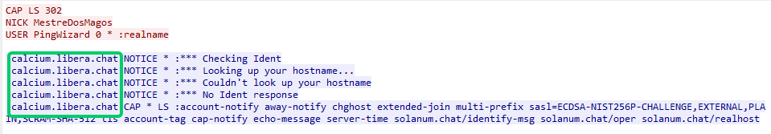

**Explanation:**
Filtering on the `irc` display filter isolates the plaintext IRC protocol traffic in the capture. Right-clicking any of those packets and choosing **Follow → TCP Stream** reassembles the full conversation, which opens with the server identifying itself as `calcium.libera.chat` — a server on the Libera.Chat IRC network.

---

### Task 1.2 - Extract the nicknames used by the malicious actors from the chat log.


**Explanation:**
Scanning the same reassembled IRC stream for `NICK` and `PRIVMSG` lines turns up three distinct nicknames used throughout the conversation: `MestreDosMagos`, `HackPT`, and `ByteRunner`.

---

### Task 1.3 - What IRC channel are the Necrocryptors using? (Channel names start with #)

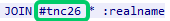

**Explanation:**
The `JOIN` command in the IRC stream shows which channel each user connects to. Here, the actor joins `#tnc26` — the group's channel.

---

### Task 1.4 - One of the actors drops a hash in the chat — likely a form of identity verification. Provide the hash value.

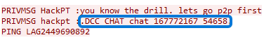

```
tcp.port==54658
```

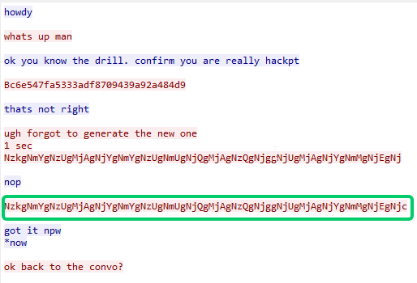

**Explanation:**
Before doing anything sensitive, the actors verify each other's identity out-of-band from the main channel. One of them asks HackPT to "confirm you are really hackpt." HackPT's first value gets rejected ("thats not right"), so a new one is generated and sent — that's the value accepted with "got it." Since this verification happens over a separate DCC connection, filtering on its TCP port (`tcp.port==54658`) and following the stream isolates that exchange; the accepted value boxed in green in the screenshot is the hash the task is asking for.

---

### Task 1.5 - Determine the country of origin for the last actor you identified in Flag 1.2. Use IP geolocation and traffic analysis to figure it out.

The last user in the conversation was ByteRunner. We got his IP from the message prompts:

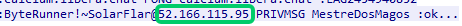

A simple curl command with ipinfo.io/52.166.115.95 gives the country of origin.

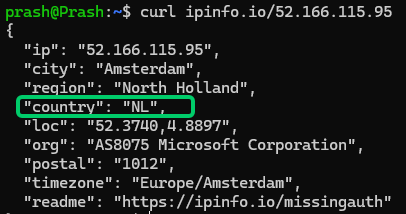

---

## Flag 2 — Encrypted Handoff

### Task 2.1 - Identify the malicious actor who initiated the private chat (DCC) during the conversation.

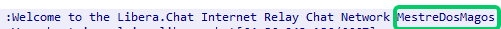

**Explanation:**
The `.DCC CHAT` request from Task 1.4 was addressed *to* HackPT, meaning it was sent *by* the other party. Tracing that packet's TCP stream back to its connection registration shows the server's welcome banner for `MestreDosMagos`, confirming they were the one who opened the private DCC connection.

---

### Task 2.2 - What is the name (and extension) of the file transferred via IRC DCC?

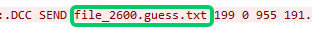

**Explanation:**
Once the private DCC channel is open, the actors switch from `DCC CHAT` to `DCC SEND` to push a file across. That request names the file directly: `file_2600.guess.txt`.

---

### Task 2.3 - Determine the encryption algorithm used to protect the file.

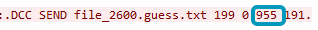
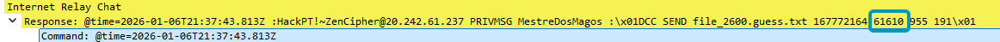
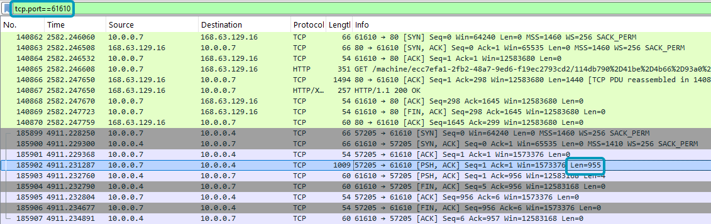

Following the TCP stream, we get a PGP public key. Now we need to find the corresponding private key. Their chat kept suggesting the key was on their server, so I filtered the chat for *dns* records to uncover any public domains associated with the group.

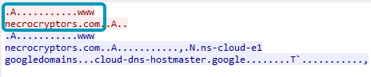

Visiting their domain prompts us to enter our GTID to output a hash.

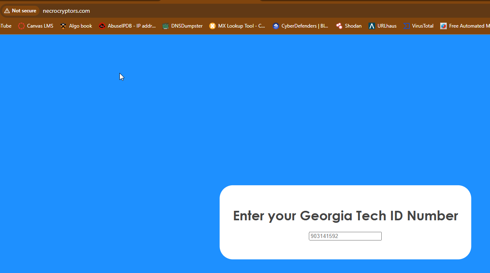

I filtered the chat log for GET requests mentioning necrocryptors and saw a request for `/mitm_private.key`.

```
http.request.method==GET
```

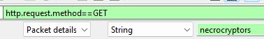


Doing a simple curl confirms the key is served at that path:

```
curl www.necrocryptors.com/mitm_private.key
```

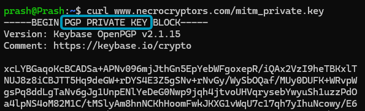

Let's go ahead and download it.

```
wget www.necrocryptors.com/mitm_private.key
```

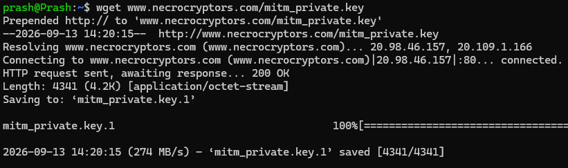

Awesome! Now that we have the private key, let's go ahead and decrypt the message we found earlier from the chat conversation that they sent to ByteRunner. We'll start by importing the key to our key ring.

```
gpg --import mitm_private.key
```

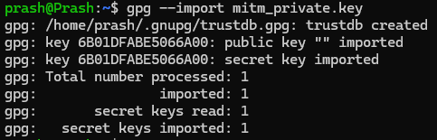

Then, decrypt the message.

```
gpg --decrypt message.asc
```

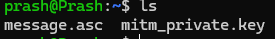
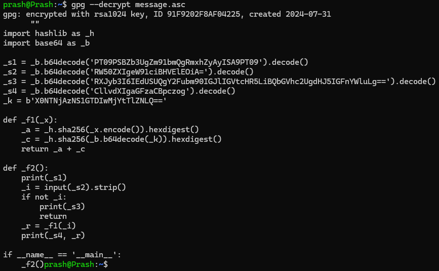

**Explanation:**
GPG reports the file was `encrypted with rsa1024 key` — so the algorithm protecting the file is **RSA, with a 1024-bit key**.

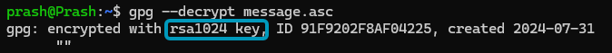

---

### Task 2.4 - After decrypting and executing the transferred file, it generates a unique hash tied to your GTID. What's the hash?

Decrypting the message gives a script written in Python. Let's save it directly to a file called *chat.py* and run it.

```
gpg --decrypt message.asc > chat.py
```

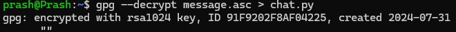

```
python3 chat.py
```

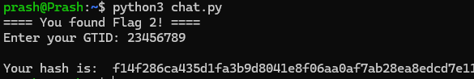

Sweet! *(The GTID used here is a placeholder, not a real GT ID.)*

---

## Flag 3 — Domain Reconnaissance

### Task 3.1 - What is the site's domain name? Include subdomains and the full TLD.

We already found this in task 2.3.


**Explanation:**
The same DNS lookup from the encryption task shows the full domain: `www.necrocryptors.com`.

---

### Task 3.2 - What is the public IP address tied to the server hosting this domain?

To get the public IP, we can issue the *dig* command. Pairing that with the *A* tag gets us the IPv4 address(es).

```
dig A www.necrocryptors.com
```

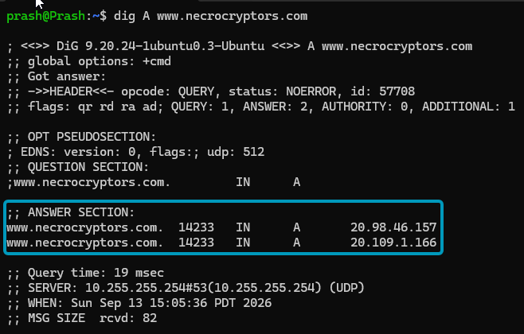

Hmm. We get two IPv4 addresses. Let's ping both to see if either one responds.

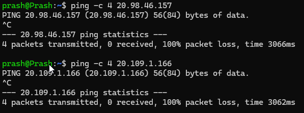

Nothing. But this doesn't necessarily mean the servers are down — they could just be blocking our ICMP (ping) requests, which is very common as a defense against ping floods or DDoS attacks. Let's try interacting with them using a simple curl instead.

```
curl 20.109.1.166
```

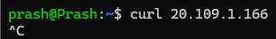

The first IP hung. Let's try the second one.

```
curl 20.98.46.157
```

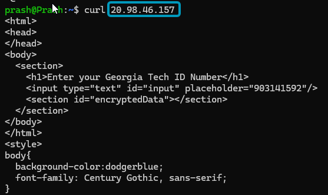

Yes sir, we got a reply. That is our IP: `20.98.46.157`.

---

### Task 3.3 - Identify the primary nameserver associated with the domain.

We can issue *dig* again, this time with the *ns* tag, to get the nameservers.

```
dig ns www.necrocryptors.com
```

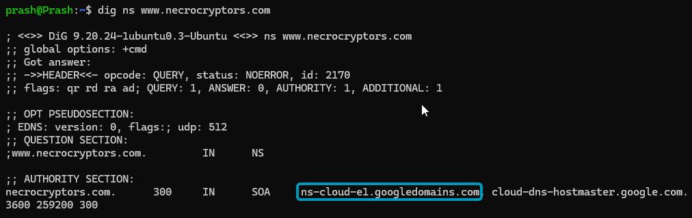

**Explanation:**
The authority section of the response names `ns-cloud-e1.googledomains.com` as the nameserver for the domain — a Google Cloud DNS server.

---

### Task 3.4 - Visit the site and enter your Georgia Tech ID to receive a unique hash. This hash will be used to track and correlate user interactions.

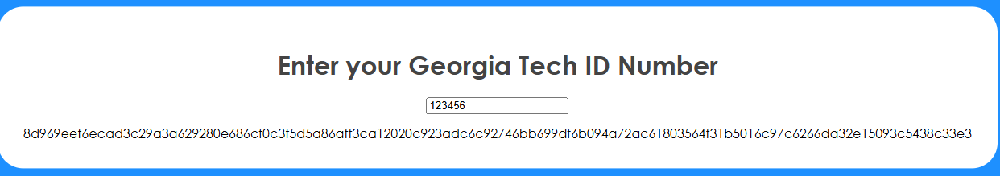

**Explanation:**
Visiting `www.necrocryptors.com` (resolving to `20.98.46.157`) and submitting a GTID in the input field returns a unique hash tied to that ID, generated server-side.

---

## Flag 4 — FTP Exfiltration

### Task 4.1 - What is the IP address of the server in question?

Let's head back to Wireshark and look at the DNS logs once more to get the server IP. `10.0.0.7` is the source (a private IP behind a NAT) sending the request out to the server to fetch the key. Hence, the destination IP is the IP of the server.

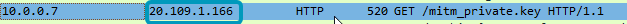

---

### Task 4.2 - What username was used to access the server?

### Task 4.3 - What password was used to log in?

To get the credentials, we filter for the FTP logs, since the adversaries used a private file transfer, and follow the TCP stream.

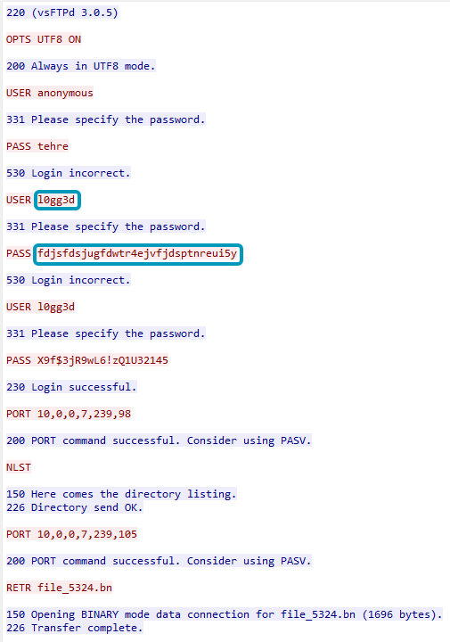

**Explanation:**
The FTP session shows several login attempts. `USER anonymous` is rejected outright, and the first attempt with `USER l0gg3d` / `PASS fdjsfdsjugfdwtr4ejvfjdsptnreui5y` also comes back "Login incorrect." The attempt that actually succeeds — the one returning `230 Login successful.` — reuses the same username with a different password: **username** `l0gg3d`, **password** `X9f$3jR9wL6!zQ1U32145`. Those are the credentials that answer 4.2 and 4.3.

---

### Task 4.4 - Identify the name of the file that was pulled from the server.

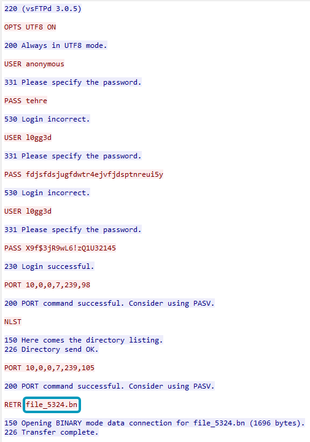

**Explanation:**
Right after the successful login, the session issues `RETR file_5324.bn` — that's the file retrieved from the server.

---

### Task 4.5 - What programming language was the file written in?

To get the programming language, we must first fetch this file. To get the file's actual contents, we filter on *ftp-data*. After filtering, we see about 3 logs about the file and follow the TCP stream to view its contents.

```
ftp-data
```

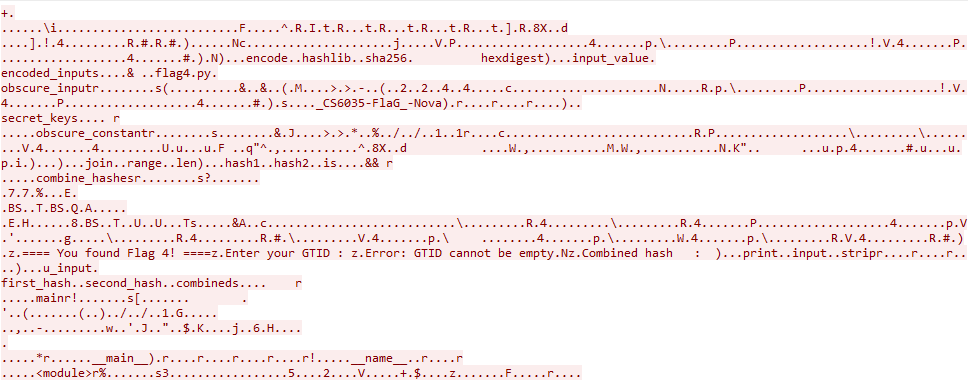

I see a lot of functions which point to this being written in Python.

---

### Task 4.6 - If you run the file, you'll generate a unique hash tied to your GTID.

I gave this to an AI tool for reverse engineering and mapping the functions to get a working Python file.

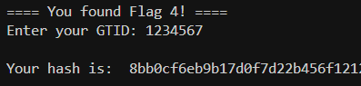

---

## Flag 5 — Cracking the Vault

### Task 5.1 - Visit http://www.didbastionbreak.com:5000 and find the page that outputs a hash when you input your GTID. Find the flag labeled 5.1.

Heading over to the website gives us nothing but an option to download a zip file.

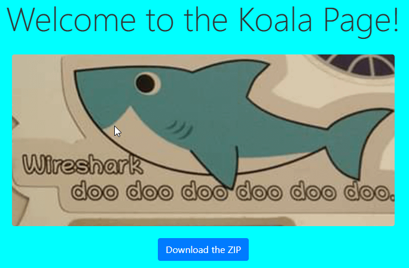

I checked its source code for any hidden messages and saw something interesting.

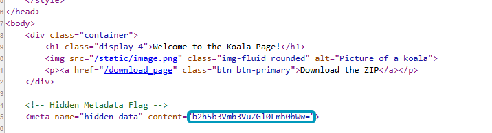

It looks like base64 encoding. Let's decode it using an online tool. I used www.base64decode.org and got a string that reads `ohyoufoundit.html`.

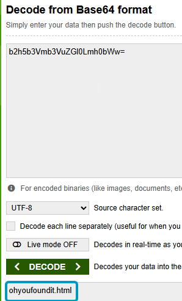

Sweet! Now let's head over to that page by appending it to the site: `http://www.didbastionbreak.com:5000/ohyoufoundit.html`

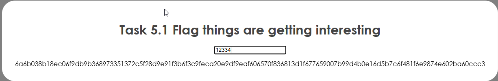

We got our hash!

---

### Task 5.2 - On the homepage, click the blue "Download the Zip" button. You'll get a password-protected zip file. Use John the Ripper to crack it. Provide the password once you retrieve it.

**Hint:** The password is up to seven digits long.

Let's download the file and crack it using John the Ripper. Since it's just a 7-digit numeric mask (from the hint), Hashcat would work equally well here.

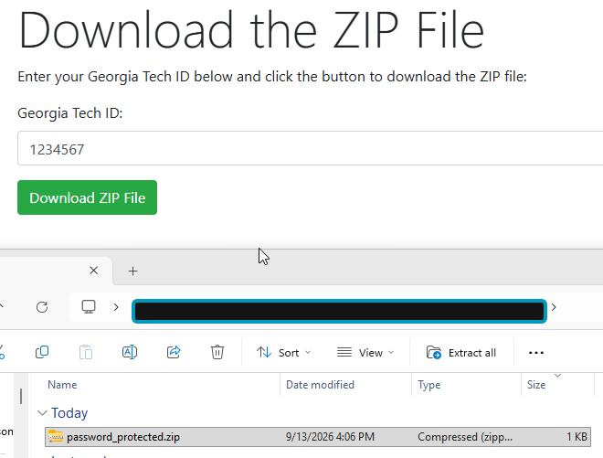

Since it's a zip file, we can't crack it directly — we generate a crackable hash from it first with *zip2john* and save that as *zip.hash*.

```
zip2john password_protected.zip > zip.hash
```

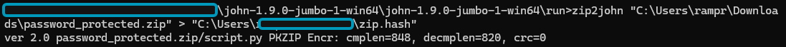

Then we run *john*, using the `--mask=?d?d?d?d?d?d?d` flag to tell it we're looking for a 7-digit numeric password.

```
john --mask=?d?d?d?d?d?d?d zip.hash
```

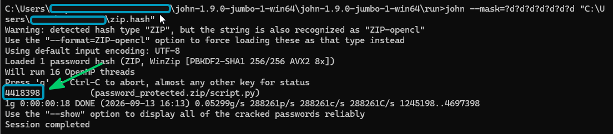

**Explanation:**
John loads the hash as a WinZip/PBKDF2-SHA1 type, runs the 7-digit numeric mask, and recovers the password: **`4418398`**.

---

### Task 5.3 - After unzipping the file with the cracked password, you'll find a program inside. Run the program. It will return a hash. What is the hash?

With the password cracked, we can supply it directly to extract the contents of the zip file.

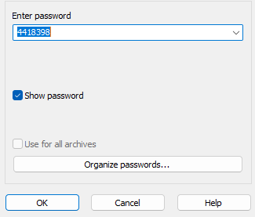

We see a Python script. Let's inspect it before running it, as a security precaution.

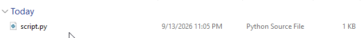

Hmm — the contents are base64 encoded again. Let's run it through *base64decode* once more.

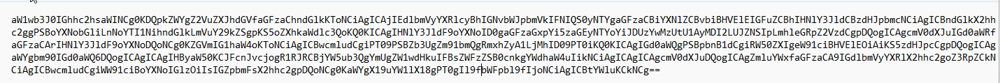
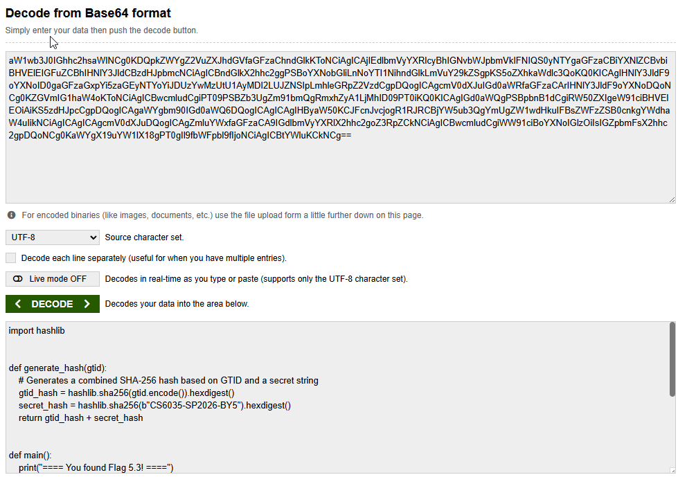

After copying the decoded contents from base64decode.org, we can finally run the script, get the flag, and wrap up this challenge!

```
python3 script.py
```

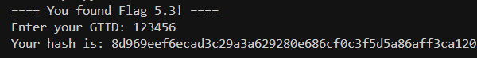
